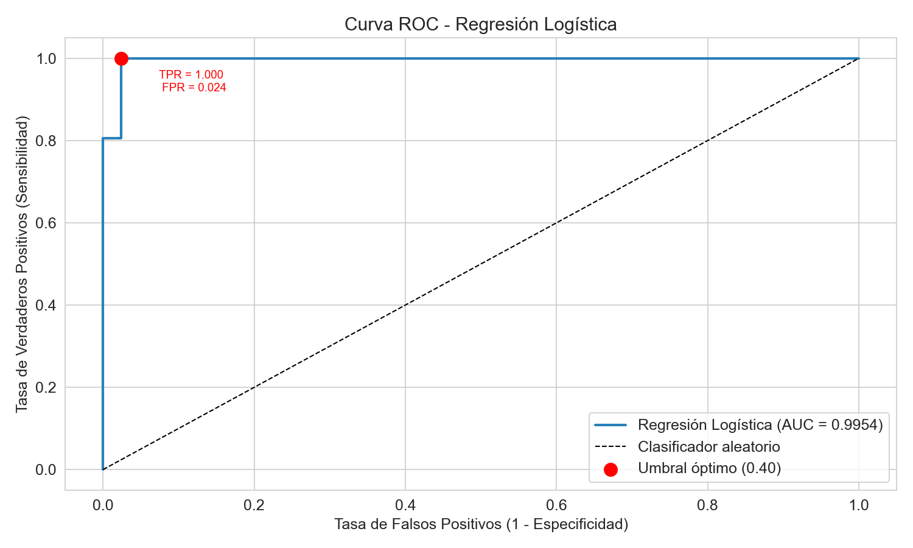
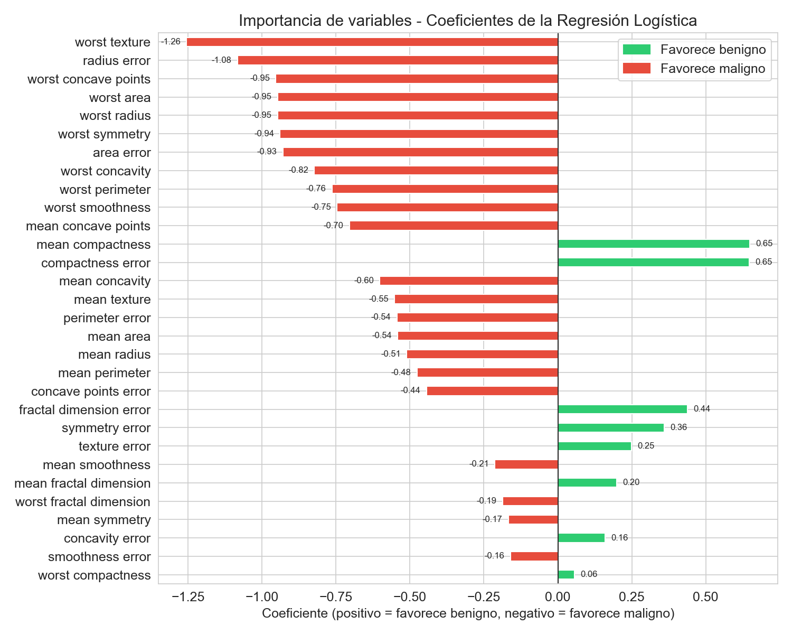

# 🔬 Optimización de umbrales de decisión en regresión logística para clasificación de cáncer de mama

**Autora:** Nerea González
**Máster en Inteligencia Artificial — Tokio School**
**Calificación: 9/10**

---

## Descripción

Este proyecto aplica regresión logística al **Wisconsin Breast Cancer Dataset** para clasificar tumores como malignos o benignos. El eje central del trabajo es la **optimización del umbral de decisión**: en lugar de usar el umbral estándar de 0.50, se analiza sistemáticamente el efecto de cada umbral sobre los falsos negativos (tumores malignos no detectados), que representan el error clínicamente más grave.

El modelo final con umbral 0.40 alcanza una **accuracy del 98.25%** y un **AUC-ROC de 0.9954**, detectando 41 de los 42 casos malignos del conjunto de prueba.

---

## Resultados principales

| Modelo                              | Accuracy   | F1-Score   | AUC-ROC    | FN    |
|-------------------------------------|------------|------------|------------|-------|
| Reg. Logística (umbral 0.50)        | 98.25%     | 0.9861     | 0.9954     | 1     |
| **Reg. Logística (umbral 0.40)**    | **98.25%** | **0.9861** | **0.9954** | **1** |
| GridSearchCV F1 (C=0.1, L2)         | 97.37%     | —          | —          | 2     |
| GridSearchCV clínico (C=0.001, L1)  | 36.84%     | —          | —          | 0     |
| Árbol de Decisión                   | 92.11%     | 0.9362     | 0.9163     | 3     |
| Red Neuronal MLP                    | 96.49%     | 0.9718     | 0.9937     | 1     |

---

## Visualizaciones

#### Curva ROC — Regresión Logística (AUC = 0.9954)


#### Interpretabilidad — Coeficientes del modelo


---

## Contenido del notebook

1. Carga y exploración del dataset
2. Preprocesamiento (train/test split + StandardScaler)
3. Regresión logística con umbral por defecto (0.50)
    3.1 Ajuste de hiperparámetros L1/L2 con GridSearchCV
4. Optimización del umbral de decisión 
5. Curva ROC y AUC
6. Comparación con árbol de decisión y red neuronal MLP + validación cruzada
7. Interpretabilidad del modelo (coeficientes)
8. Resumen de resultados
  
---

## Dataset
  
**Wisconsin Breast Cancer Dataset** — disponible en `sklearn.datasets.load_breast_cancer()`
  
- 569 muestras · 30 características numéricas · 2 clases (maligno / benigno)
- Distribución: 212 malignos (37%) / 357 benignos (63%)

---
  
## Requisitos

```bash
pip install numpy pandas matplotlib seaborn scikit-learn
```

> Compatible con Python 3.8+

---

# 🔬 Decision Threshold Optimization in Logistic Regression for Breast Cancer Classification

**Author:** Nerea González
**Master's in Artificial Intelligence — Tokio School**
**Grade: 9/10**

---

## Description

This project applies logistic regression to the **Wisconsin Breast Cancer Dataset** to classify tumors as malignant or benign. The core focus is **decision threshold optimization**: rather than using the standard 0.50 threshold, the effect of each threshold on false negatives (undetected malignant tumors) — the clinically most critical error — is systematically analyzed.

The final model with threshold 0.40 achieves **98.25% accuracy** and an **AUC-ROC of 0.9954**, detecting 41 out of 42 malignant cases in the test set.

---

## Main Results

| Model                                    | Accuracy   | F1-Score   | AUC-ROC    | FN    |
|------------------------------------------|------------|------------|------------|-------|
| Logistic Regression (threshold 0.50)     | 98.25%     | 0.9861     | 0.9954     | 1     |
| **Logistic Regression (threshold 0.40)** | **98.25%** | **0.9861** | **0.9954** | **1** |
| GridSearchCV F1 (C=0.1, L2)              | 97.37%     | —          | —          | 2     |
| GridSearchCV clinical (C=0.001, L1)      | 36.84%     | —          | —          | 0     |
| Decision Tree                            | 92.11%     | 0.9362     | 0.9163     | 3     |
| Neural Network (MLP)                     | 96.49%     | 0.9718     | 0.9937     | 1     |

---

## Visualizations

#### ROC Curve — Logistic Regression (AUC = 0.9954)


#### Interpretability — Model Coefficients


---

## Notebook Contents

1. Dataset loading and exploration
2. Preprocessing (train/test split + StandardScaler)
3. Logistic regression with default threshold (0.50)
    3.1 L1/L2 hyperparameter tuning with GridSearchCV
4. Decision threshold optimization 
5. ROC curve and AUC
6. Comparison with decision tree and MLP neural network + cross-validation
7. Model interpretability (coefficients)
8. Results summary
  
---

## Dataset

**Wisconsin Breast Cancer Dataset** — available via `sklearn.datasets.load_breast_cancer()`
  
- 569 samples · 30 numerical features · 2 classes (malignant / benign)
- Distribution: 212 malignant (37%) / 357 benign (63%)

---

## Requirements
  
```bash
pip install numpy pandas matplotlib seaborn scikit-learn
``` 

> Compatible with Python 3.8+